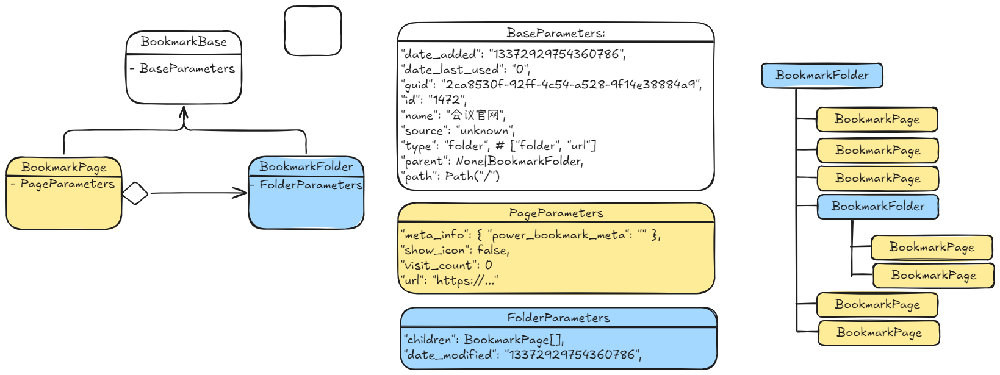

# 用于合并 Chrome 和 Edge 浏览器书签的项目

## 一、项目介绍

使用 python 完成 chrome 和 edge 浏览器的书签合并。原理是解析两个浏览器的本地书签文件（json 格式），然后进行内容合并和回写。

注：以防万一，每次回写会对回写的书签文件（json 格式）进行备份，备份文件与原始文件的位置相同，并带有`.bak`后缀

## 二、项目结构

核心模块目录：`<项目根目录>/src`

- `constant.py`: 包含 windows 格式下 chrome 和 edge 的本地书签文件的默认路径。
- `entity.py`: 实现了保存书签信息（`BookmarkPage`）和书签目录（`BookmarkFolder`）的抽象类，以及对应书签目录的迭代器（迭代器可以使用书签目录类`get_yield`函数代替）。实现思路是采用组合模式（一种设计模式），将书签构建为组合树，然后进行合并、回写操作。部分操作已经封装为独立的功能函数，详情见`functional.py`文件。
- `functional.py`: 将一些解析、回写等操作封装为独立的功能函数，可以通过直接调用这些函数实现抽象类的一些功能。
- `metaclasses.py`: 实现了两个元类：日志元类、计时元类。这两个元类分别提供了类内内置日志和函数执行计时功能。但是只使用了日志元类的功能。计时元类可以用于测试性能。

功能测试目录：`<项目根目录>/test`

主要提供了部分功能的测试代码。需要注意的是，这三个测试文件都需要拖放到项目根目录才能正常运行，否则会出现导包错误。

## 三、开发环境

本项目使用 uv 进行项目管理，并提供了相应的项目配置文件（`pyproject.toml`）。可以使用 uv 进行方便的环境配置。

本项目大部分功能均使用 python 标准库实现。

## 四、开发感想

本项目原计划是合并两个浏览器使用"导出书签"后的 html 文件进行书签合并的。奈何格式太奇怪，简直就是披着 html 的 xml 文件，没想到比较方便的解析方式。

为了解决这个问题，在网上查找一番后，发现其他人用的都是本地文件中的书签信息，并且是 json 格式的，更好解析。于是，非常高兴的采用了！

虽然这样了，但是希望以后还是能够把 html 格式的书签文件的合并整理完成，毕竟直接修改本地的 json 配置我觉得不太好，而且考虑到文件中有 checksum 这种校验和存在，可能会影响 chrome 或者 edge 的书签同步功能。具体是否有影响还有待测试。

## 五、未来计划

说是未来计划，但是不一定会做：

- [ ] 基于 html 的解析和回写
- [ ] 更高性能的合并操作
- [ ] 跨平台支持
- [ ] 多浏览器支持

补充其他不足：

- [ ] 对一些函数的传参没有做健壮性检查（类型、内容检查）。
- [ ] 尝试使用`json.load()`函数的`object_hook`参数来设置生成类型。
- [x] `NoReturn`用于`会出现死循环`或者`抛出异常`的情况，而不是无返回值的情况，无返回值的情况应该使用`None`。
- [ ] 尝试使用 `TypedDict`，对字典类型做类型标注。
- [x] `Generator`类型标注不完整，应该注明内容元素的类型
- [ ] 使用 `BeautifulSoup` 可以完成带有`<DT> <DL> <DD>` 标签的 html 文件。这三个标签是允许没有闭合标签的。
- [x] `set` 参数是 `Iteratable` 即可，无需先转换为 `List` 类型。
- [ ] 使用 `LoggerMeta` 元类来为每一个对象配置 `logger` 是不必要的，因为 `logging` 本身是支持详细信息的（通过 `format` 参数配置即可）。
- [ ] `merge` 方法使用树的合并方式而不是过滤+插入的方式来解决。
