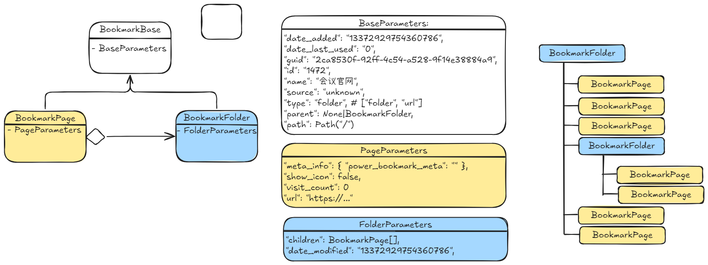

# BookmarkClearup

BookmarkClearup 是一个使用 Python 编写的本地桌面与命令行工具，用于安全合并 Chrome 和 Edge 书签。项目当前版本为 `0.1.0`，支持 Chromium JSON、Netscape Bookmark HTML，以及两种格式的混合输入和转换输出。

工具默认只执行 dry-run 并输出统计，不会修改任何书签文件。只有显式指定输出位置或确认原地覆盖时才会写入；原地覆盖前会自动创建备份。

## 当前能力

| 能力 | 支持情况 |
| --- | --- |
| Chrome / Edge Chromium JSON | 支持 |
| Netscape Bookmark HTML | 支持 |
| JSON 与 HTML 混合合并 | 支持 |
| JSON 与 HTML 相互转换 | 支持 |
| Windows / macOS / Linux 常见 Profile 路径 | 支持 |
| 多个来源文件 | 支持 |
| PySide6 桌面界面 | 支持 |
| Firefox Profile 直接读取 | 暂不支持 |

JSON 会独立处理 `bookmark_bar`、`other`、`synced` 三个根节点。HTML 没有对应的多根结构，因此统一映射到 `bookmark_bar`。

## 环境与安装

- Python 3.11 或更高版本
- [uv](https://docs.astral.sh/uv/)

在项目根目录安装运行和开发依赖：

```powershell
uv sync
```

查看全部命令行参数：

```powershell
uv run python main.py --help
```

## 桌面界面

启动 PySide6 桌面界面：

```powershell
uv run python gui_main.py
```

“合并书签”页支持文件或 Chrome/Edge Profile 输入，可选择仅预览、保存单一结果、生成各浏览器可独立采用的结果，或确认后覆盖基准文件。右侧显示合并统计、操作摘要和运行日志。

“备份管理”页支持扫描指定目录，并按起止时间筛选、清理本工具生成的备份。GUI 默认使用仅预览模式；覆盖书签和删除备份均需弹窗确认。

界面设计与安全交互说明见 [`doc/ai/GUI功能设计.md`](doc/ai/GUI功能设计.md)。

## 快速开始

### 预览合并结果

命令必须指定一个基准文件和至少一个来源文件。默认只打印统计，不创建或修改文件：

```powershell
uv run python main.py --base .\chrome.json --source .\edge.json
```

可以一次合并多个来源：

```powershell
uv run python main.py --base .\chrome.json --source .\edge.json .\archive.html
```

输出格式类似：

```text
base=120 sources=80 new=15 result=135
```

### 写入新文件

使用 `--output` 创建单一结果。目标文件必须尚不存在，格式默认根据目标扩展名判断：

```powershell
uv run python main.py --base .\chrome.json --source .\edge.json --output .\merged.json
```

通过目标扩展名或 `--output-format` 可以转换格式：

```powershell
uv run python main.py --base .\chrome.json --source .\edge.html --output .\merged.html
uv run python main.py --base .\bookmarks.html --source .\edge.json --output .\merged.json --output-format json
```

使用 `--output-dir` 为每个输入生成一个采用其各自外壳和格式的独立结果：

```powershell
uv run python main.py --base .\chrome.json --source .\edge.json --output-dir .\merged
```

基准结果使用 `{基准文件名}_merged`，来源结果依次使用 `source_1_merged`、`source_2_merged`。任一目标已存在时，整组输出会被拒绝。

## 浏览器 Profile 模式

项目可以发现 Chrome 或 Edge 的本地 Profile：

```powershell
uv run python main.py --list-profiles chrome
uv run python main.py --list-profiles edge
```

使用 Profile 路径执行合并：

```powershell
uv run python main.py `
  --base-browser chrome --base-profile Default `
  --source-browser edge --source-profile Default `
  --output-dir .\merged
```

Profile 模式与 `--base`、`--source` 显式路径模式互斥。当前支持 Windows、macOS、Linux 的常见 Chrome 和 Edge 用户数据目录。

## 安全写回与备份

只有 `--in-place` 会覆盖基准文件。交互运行时必须输入 `yes`：

```powershell
uv run python main.py --base .\base.json --source .\edge.json --in-place
```

自动化场景必须同时传入 `--yes`：

```powershell
uv run python main.py --base .\base.json --source .\edge.json --in-place --yes
```

写回过程会在同一目录创建临时文件，完成序列化和格式验证后再原子替换原文件。覆盖前生成一份备份，命名格式如下：

```text
原文件名.YYYYMMDD_HHMMSS_bookmark_backup[_序号].bak
```

恢复前应先关闭浏览器，再将备份复制回原始路径：

```powershell
Copy-Item .\base.json.20260902_120000_bookmark_backup.bak .\base.json -Force
```

### 清理备份

备份不会自动删除。`--clean-backups` 默认只列出匹配文件，可用起止时间缩小范围：

```powershell
uv run python main.py --clean-backups .\bookmarks --start 20260901_000000 --end 20260930_235959
```

确认列表无误后增加 `--yes` 执行删除：

```powershell
uv run python main.py --clean-backups .\bookmarks --start 20260901_000000 --end 20260930_235959 --yes
```

清理命令只识别本工具生成的备份文件名，时间范围包含起止时刻。

## 合并规则

- 当前策略为 `exact-url`。
- 合并按书签根节点和目录路径分别进行。
- 相同 URL 位于不同目录时会保留多份。
- 同一目录中的相同 URL 只保留一份。
- 冲突时依次比较 `date_last_used` 和 `date_added`，保留时间较新的记录；非法时间按 `0` 处理。
- 合并保持稳定顺序，不修改输入对象。
- 来源中缺失的受支持根节点会从其他输入补入。

Chromium JSON 输出会保留对应输入的 checksum、未知顶层字段和未知 roots。checksum 当前原样保留，不会重新计算，浏览器可能在加载后自行重建。

## HTML 工作流

HTML 按 Netscape Bookmark 格式以 UTF-8 读写，保留 H1/TITLE 根名称、目录层级、标题、URL、`ADD_DATE` 和 `LAST_MODIFIED`。

HTML 使用 Unix 秒，Chromium JSON 使用 WebKit 微秒，工具会在两种时间格式之间转换。无法识别的 HTML 扩展属性不会写回。

HTML 输入统一映射为 `bookmark_bar`。导出 HTML 时也只输出 `bookmark_bar`；JSON 中的 `other` 和 `synced` 仍会在 JSON 结果中独立合并。

## 项目结构



```text
BookmarkClearup/
├── main.py                 # CLI 入口
├── src/
│   ├── cli.py              # 参数解析与工作流调度
│   ├── entity.py           # 书签树模型
│   ├── functional.py       # 解析、遍历与合并逻辑
├── gui_main.py             # GUI 入口
│   ├── bookmark_io.py      # Chromium JSON 读写与备份清理
│   ├── html_io.py          # Netscape HTML 导入导出
│   ├── gui.py              # PySide6 桌面界面
│   ├── safe_file.py        # 安全原子写入
│   ├── chromium.py         # 浏览器路径与 Profile 发现
│   ├── constant.py         # 默认路径常量
│   └── metaclasses.py      # 日志与计时元类
├── test/                   # pytest 测试、GUI 测试与脱敏 fixture
├── asset/                  # 项目结构图
└── doc/ai/                 # 开发计划与阶段记录
```

## 测试

运行完整自动化测试：

```powershell
uv run pytest -q
```

当前基线包含 78 项测试，覆盖核心合并规则、JSON/HTML 往返、安全写入、备份清理、Profile 路径、格式转换、失败回滚和 GUI 参数映射与确认流程。

测试使用脱敏的 Chrome-like 与 Edge-like fixture，不读取本机真实浏览器数据。

## 已知限制

- 尚未在隔离账号下完成真实 Chrome/Edge 打开、同步和再次保存的人工验证。
- Chromium checksum 只保留原值，不重新计算。
- Firefox 尚未适配。
- 项目尚未配置静态检查、覆盖率、CI 和正式发布流程。
- 当前版本定位为经过自动化测试的本地开发工具，不应视为已完成发布验收的正式产品。

## 开发感想

### 2025-03-25：从 Chromium JSON 开始

项目最初计划合并浏览器导出的 HTML 书签。Netscape Bookmark HTML 允许部分标签不闭合，结构更像宽松的树形交换格式，当时没有找到足够稳妥的解析方式，因此先转向结构明确的 Chromium 本地 JSON 文件。

JSON 更容易解析和合并，但直接修改浏览器配置也带来了新的顾虑：checksum、同步以及浏览器重新保存时的行为都需要验证。这些顾虑后来成为 dry-run、备份和原子写入设计的起点。

### 2026-09-02：补齐安全性与完整工作流

这一轮开发重新建立了自动化测试基线，明确了 URL 去重和较新记录胜出的规则，并把原来的脚本整理为默认 dry-run 的 CLI。写回现在需要显式确认，并通过同目录临时文件、格式验证、备份和原子替换降低数据损坏风险。

项目也重新处理了最初放弃的 HTML 工作流。借助 `lxml` 解析 Netscape 格式后，已经可以保留主要层级和时间信息，并支持 JSON/HTML 混合合并。Chrome 和 Edge 的常见 Profile 路径也扩展到了 Windows、macOS、Linux。

### 2026-09-03：后续开发思路

下一步首先应在隔离浏览器配置和测试账号下完成发布门禁，验证 Chrome/Edge 能否正常打开合并结果、参与同步并再次保存，尤其需要观察 checksum 的实际处理方式。

之后再补齐静态检查、覆盖率、CI、安装方式、故障排查和版本发布流程，将项目从本地脚本整理为可安装的正式 CLI 包。

性能优化应建立在真实规模基准上。需要分别测量解析、合并和序列化，再决定是否引入 URL 索引或调整树合并策略，避免用复杂实现交换未经证实的收益。

Firefox 适配可以作为独立阶段评估。它不应只增加一个路径常量，而应先确认书签存储格式、写回安全性及与现有 JSON/HTML 中间模型的边界。

### 2026-09-22：新增桌面界面

项目新增基于 PySide6 的桌面工作台，将文件选择、浏览器 Profile、输出方式、格式转换、合并统计和运行日志集中到同一界面。备份扫描和按时间范围清理也有独立页面。

GUI 继续复用现有 CLI 与安全写入逻辑：默认只预览，覆盖基准文件前自动备份并要求弹窗确认，删除备份同样需要显式确认。本轮将自动化测试基线扩充到 78 项。
