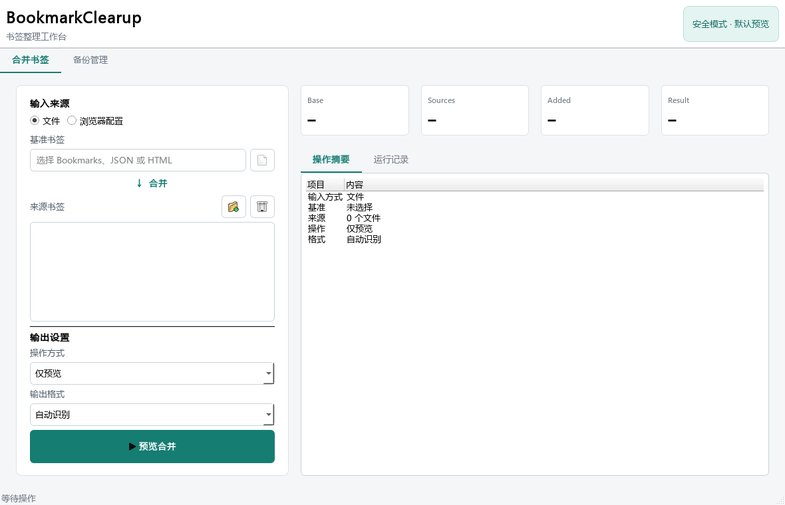
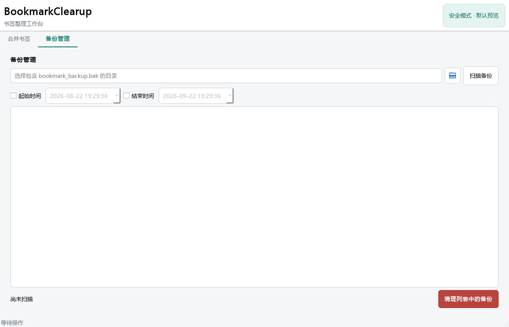

# BookmarkClearup GUI 功能设计
## 1. 目标
为个人书签整理工具提供清晰、可靠的桌面操作界面，覆盖 JSON 与 HTML 书签合并、浏览器 Profile 选择、结果预览、独立结果生成、原文件覆盖和备份清理。界面默认执行 dry-run，任何覆盖或删除操作都需要用户二次确认。
## 2. 技术方案
- GUI 框架：PySide6。
- 启动入口：`uv run python gui_main.py`。
- 业务复用：GUI 通过现有 CLI 参数契约调用合并流程，不重复实现解析、合并、备份逻辑。
- 长任务处理：合并命令在 `QThread` 中运行，避免界面阻塞。
## 3. 视觉方向
- 工作区使用浅灰背景，内容面板使用白色，形成明确层级。
- 主操作使用青绿色，风险提示使用琥珀色，清理操作使用红色。
- 标题优先使用 Segoe UI Variable，中文正文使用 Microsoft YaHei UI，统计与日志使用 Cascadia Mono。
- 控件圆角控制在 6 至 8 像素，布局紧凑，适合重复操作，不使用装饰性大卡片或无关动画。
## 4. 信息架构
### 4.1 合并书签
- 左侧输入区：切换“文件”与“浏览器配置”两种来源。
- 文件模式：选择一个基准文件，添加一个或多个来源文件。
- 浏览器模式：分别选择 Chrome 或 Edge 及其 Profile。
- 输出设置：提供仅预览、保存单一结果、生成独立结果、覆盖基准文件四种方式。
- 格式设置：支持自动识别、JSON、HTML。
- 右侧结果区：显示 Base、Sources、Added、Result 四项统计，以及操作摘要和运行日志。
### 4.2 备份管理
- 选择备份所在目录并扫描。
- 可选起始时间和结束时间筛选。
- 显示符合条件的备份列表与数量。
- 清理操作只作用于当前筛选结果，并需要弹窗确认。
## 5. 安全规则
- 默认操作为“仅预览”，不修改输入文件。
- 覆盖基准文件前显示明确警告，并通过弹窗要求再次确认。
- 覆盖操作沿用现有备份机制，备份名包含完整时间。
- 备份清理默认不可用，只有扫描到文件后才启用。
- 输入路径和 Profile 在执行前验证；错误直接展示在状态栏和提示框中。
## 6. 交互流程
1. 用户选择文件或浏览器 Profile。
2. 用户选择输出方式和格式。
3. 界面实时更新操作摘要。
4. 用户执行操作；覆盖模式先确认，其余模式直接运行。
5. 后台线程调用现有 CLI，界面显示命令输出与统计结果。
6. 操作结束后恢复按钮状态，并在状态栏显示结果。
## 7. 验收标准
- 1180×760 默认窗口下无控件重叠、文字截断或异常空白。
- 最小窗口尺寸下布局保持可读。
- 默认模式不写入文件。
- 文件模式与浏览器 Profile 模式可构建正确 CLI 参数。
- 单一输出、独立输出和覆盖模式分别映射到正确参数。
- 取消覆盖或取消清理时不产生修改。
- 成功执行后统计卡片能够解析 CLI 输出。
- GUI 专项测试、全量测试、编译检查和 `git diff --check` 全部通过。
## 8. 界面预览

